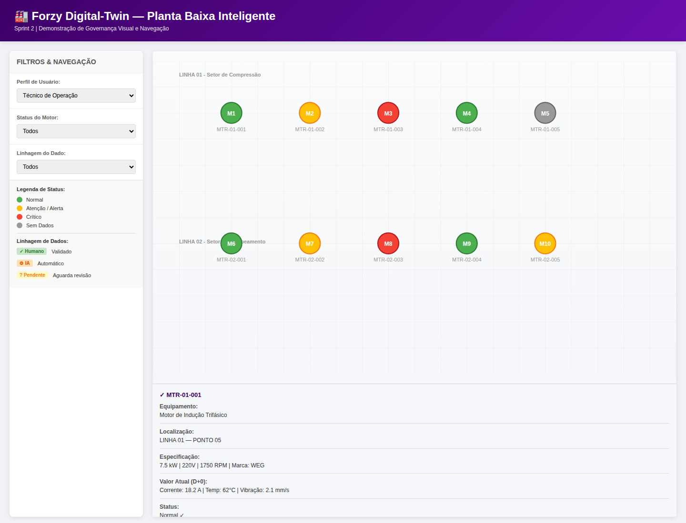
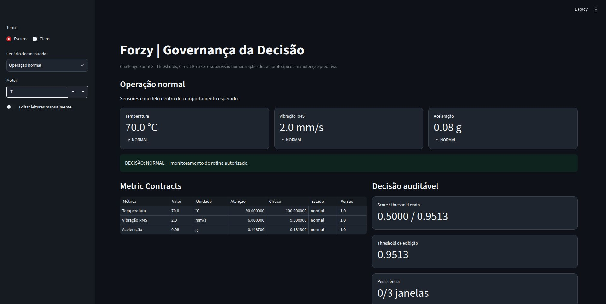
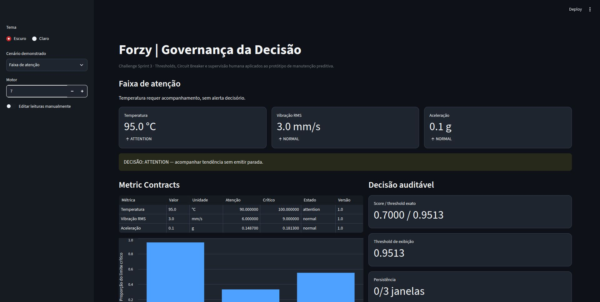
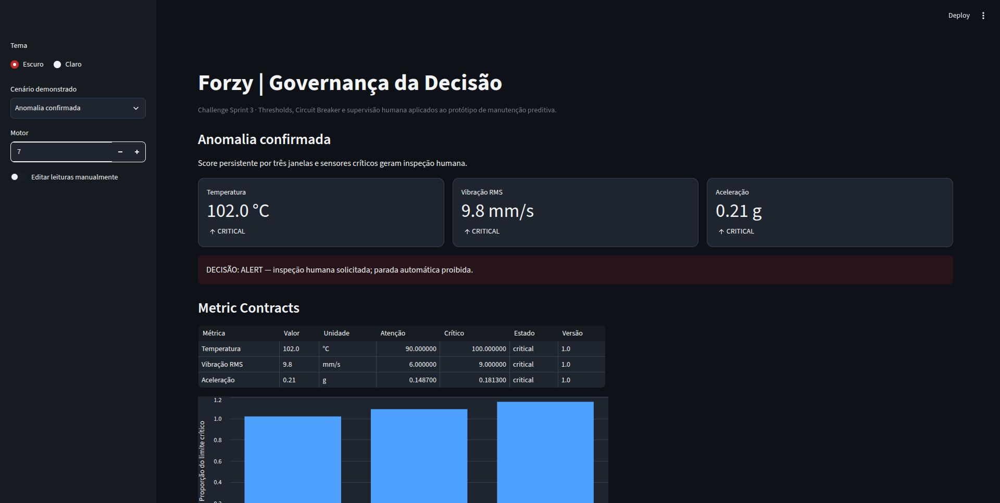
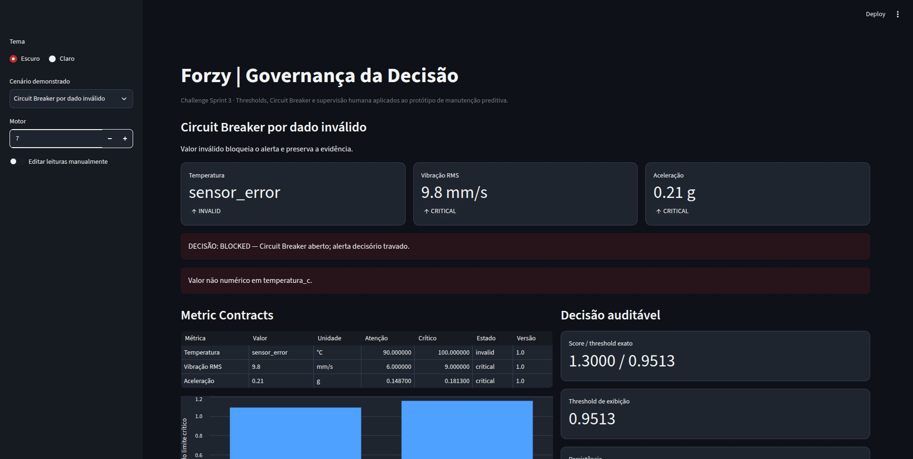
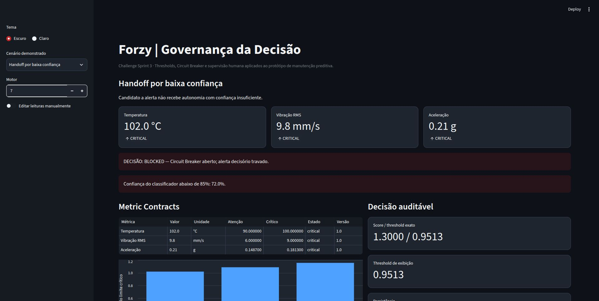

# GOVERNANÇA EM IA E BUSINESS ANALYTICS

## Inteligência Operacional e Governança da Decisão — Challenge Sprint 3

**Solução Digital Twin Forzy** 
**Ano:** 2026 
**Professor:** Marco Fontoura

**Integrantes**

- RM566479 — Jonas Alaf da Silva
- RM562358 — Murilo Benhossi
- RM565460 — Pedro Leal Murad
- RM561401 — Luís Fernando de Oliveira Salgado
- RM565522 — Ricardo de Paiva Melo
- RM553273 — Nicolas Lemos Ribeiro

## RESUMO

Este documento vivo consolida a evolução da governança da plataforma Forzy. A primeira
sprint estruturou acesso, explicabilidade, rastreabilidade e fairness. A segunda levou esses
controles para a interface e para a navegação dos ativos. A terceira formaliza os limites da
inteligência operacional por meio de Metric Contracts, thresholds físicos, regra de anomalia,
Circuit Breaker e protocolo de handoff humano. A aplicação demonstrável mantém a decisão
física sob responsabilidade de um especialista e registra por que cada alerta foi emitido,
bloqueado ou encaminhado.

**Palavras-chave:** Governança de IA. Metric Contract. Threshold. Circuit Breaker. Handoff.
Manutenção preditiva.

## LISTA DE FIGURAS

- Figura 1 — Mockup navegável da planta baixa na Sprint 2 ....................................... 10
- Figura 2 — Operação dos sensores dentro dos Metric Contracts .................................. 19
- Figura 3 — Sensor na faixa de atenção .......................................................... 20
- Figura 4 — Anomalia persistente confirmada para inspeção humana ................................. 21
- Figura 5 — Circuit Breaker acionado por dado inválido ........................................... 22
- Figura 6 — Handoff acionado por baixa confiança .................................................. 23

# 1 INTRODUÇÃO

A plataforma Forzy monitora motores elétricos industriais por meio de dados de rotação,
vibração, temperatura e corrente. O trabalho de GenAI acrescentou classificação de falhas e
detecção semissupervisionada de anomalias em janelas temporais. A existência de um modelo,
entretanto, não define sozinha quando uma recomendação é confiável ou qual ação pode ser
executada sem supervisão.

Nesta sprint, a governança é tratada como uma camada operacional sobre o modelo. Seu papel é
formalizar os limites dos sensores, separar desvio físico de desvio estatístico, bloquear
alertas em condições de dados ou incerteza inadequadas e transferir decisões críticas para o
especialista. Essa evolução responde diretamente aos feedbacks anteriores: restaura a lógica
de documento vivo, recupera o detalhamento da primeira sprint e substitui o mockup estático
por uma aplicação executável.

# 2 CONTEXTUALIZAÇÃO DA SOLUÇÃO FORZY

A solução é organizada em cinco módulos integrados: extração de dados, registro de
equipamentos, interface, modelagem e integração conversacional. O banco acadêmico contém
30.000 leituras sintéticas de 20 motores, registradas em intervalos de um minuto durante 25
horas. As variáveis originais são rotação, vibração, temperatura e corrente.

O detector de anomalias aprende o comportamento normal de cada motor por mediana e intervalo
interquartil das primeiras 30 leituras. Em seguida, processa janelas de 30 minutos com avanço
de cinco minutos. O threshold do Autoencoder foi calculado no percentil 99 das janelas normais
de validação e vale exatamente 0,9512501159120564; a interface o apresenta arredondado como
0,9513. Um alerta só é persistente depois de três janelas consecutivas acima desse valor.

Para atender ao escopo de governança, o protótipo acrescenta `aceleracao_g`. Essa variável é
uma simulação equivalente derivada da vibração RMS, considerando componente dominante de 60
Hz e ruído determinístico. Ela não é apresentada como medição industrial nem passa a integrar
retroativamente as features do modelo treinado.

# 3 EVOLUÇÃO DA GOVERNANÇA — SPRINT 1

## 3.1 Hierarquia e controle de acesso

A primeira sprint definiu quatro papéis operacionais segundo o princípio de menor privilégio.
Essa separação foi preservada porque a nova camada de decisão não pode dar a todos os usuários
o mesmo acesso aos dados, aos parâmetros dos modelos ou aos controles da planta.

O **Técnico de Operação** acompanha valores em tempo real por TAG, recebe alertas em linguagem
operacional, consulta orientações e registra ocorrências. Ele não altera contratos, parâmetros do
modelo ou configurações de segurança. O **Gestor de Planta** acompanha o histórico completo,
relatórios e indicadores operacionais, além de propor alterações de limites que ainda dependem
do processo formal de revisão.

O **Engenheiro de Dados/IA** acessa dados brutos, versões de modelos, métricas e pipelines para
investigar desvios e manter os artefatos. O **Auditor de Segurança/TI** consulta trilhas de
auditoria em modo leitura e verifica quem executou cada ação. Na Sprint 3, o Engenheiro de
Manutenção passa a ser o destinatário operacional do handoff, sem receber permissão para
reescrever retroativamente os registros.

**Quadro 1 — Papéis e responsabilidades na plataforma Forzy**

| Papel | Responsabilidade principal | Relação com a Sprint 3 |
|---|---|---|
| Técnico de Operação | Monitorar motores, receber alertas e registrar ocorrências | Visualiza alertas e evidências, sem alterar contratos |
| Gestor de Planta | Gerenciar ativos, histórico e limites operacionais | Propõe e aprova revisões dos limites da planta |
| Engenheiro de Dados/IA | Validar dados, modelos e pipelines | Mantém versão do modelo e investiga divergências |
| Auditor de Segurança/TI | Consultar logs imutáveis em modo leitura | Audita contrato, breaker, handoff e decisão humana |

Fonte: Elaborado pelos autores (2026), com base na Sprint 1.

**Quadro 2 — Matriz RBAC preservada e refinada**

| Módulo ou recurso | Técnico de Operação | Gestor de Planta | Engenheiro de Dados/IA | Auditor de Segurança/TI |
|---|---|---|---|---|
| Dashboard em tempo real | Leitura | Leitura | Leitura técnica | Auditoria |
| Dados brutos | Negado | Negado | Leitura | Auditoria |
| Alertas de anomalia | Receber e registrar | Receber e acompanhar | Configurar modelo | Auditar |
| Histórico | Últimos 7 dias | Completo | Completo | Completo em leitura |
| Cadastro por visão computacional | Executar captura | Aprovar | Validar algoritmo | Auditar |
| Limites operacionais | Visualizar | Propor e aprovar revisão | Configurar após aprovação | Auditar versão |
| Modelos de ML | Negado | Negado | Acesso completo | Auditar versão |
| Logs de auditoria | Negado | Negado | Consulta técnica limitada | Acesso completo em leitura |
| Chatbot e manuais | Consultar | Consultar | Consultar | Sem acesso operacional |
| Decisão física sobre o motor | Seguir procedimento autorizado | Coordenar procedimento | Sem comando físico | Sem comando físico |

Fonte: Elaborado pelos autores (2026), com base na matriz RBAC da Sprint 1 e nos limites da
Sprint 3.

## 3.2 Cadeia D-I-C-I

O fluxo Dado–Informação–Conhecimento–Inteligência permanece como estrutura explicativa do
ativo. No nível de **Dado**, cada leitura bruta é vinculada ao motor, ao tipo de sensor, ao
timestamp e à unidade recebida. No nível de **Informação**, o pipeline confere se a unidade
recebida corresponde à unidade contratada e verifica domínio físico, atualidade, completude e duplicidade, produzindo
um estado de qualidade.

No nível de **Conhecimento**, as leituras aprovadas são comparadas com o baseline individual do
motor, com os thresholds físicos e com o histórico de janelas. O modelo calcula o score de
anomalia, mas esse score é tratado como evidência estatística e não como causa física
comprovada. No nível de **Inteligência**, a recomendação passa pelos limites de persistência,
confiança, coerência física e Circuit Breaker antes de chegar ao usuário.

**Quadro 3 — Cadeia D-I-C-I atualizada**

| Nível | Entrada e tratamento | Responsável | Saída governada |
|---|---|---|---|
| Dado | Leitura bruta, motor, timestamp e unidade original | Módulo de extração | Registro identificável da leitura |
| Informação | Validação da unidade e controles de qualidade | Pipeline de dados | Valor validado com estado de qualidade |
| Conhecimento | Baseline, thresholds, histórico e score do modelo | Regras e modelo de ML | Desvio físico ou estatístico contextualizado |
| Inteligência | Persistência, confiança, Circuit Breaker e limites de autonomia | Serviço de governança | Decisão explicável, bloqueio ou handoff |

Fonte: Elaborado pelos autores (2026), a partir da cadeia D-I-C-I da Sprint 1.

Na Sprint 3, a passagem de Conhecimento para Inteligência deixa de ser automática em qualquer
condição. O Circuit Breaker verifica se a recomendação possui qualidade e certeza suficientes.

## 3.3 Explainability

Na primeira sprint, o risco de caixa-preta foi tratado exigindo que todo alerta apresentasse o
sensor envolvido, o valor observado, a referência utilizada, uma explicação compreensível e a
ação recomendada. O nível de detalhe varia conforme o perfil: o Técnico de Operação precisa
entender condição, urgência e ação segura; o Engenheiro de Dados/IA também precisa consultar
score, parâmetros, versão e evidências técnicas.

Na Sprint 3, o alerta executável informa motor, horário, leituras, unidades, threshold
ultrapassado, score do modelo, persistência, confiança, ação permitida e versão do contrato. A
explicação descreve associação e prioridade de inspeção, sem afirmar uma causa física que não
foi confirmada. Essa correção também substitui a proposta inicial de modelos hipotéticos pela
implementação realmente utilizada: baseline estatístico, Isolation Forest e Autoencoder, com o
Autoencoder adotado no cenário demonstrável.

## 3.4 Protocolo de rastreabilidade

O cadastro por Visão Computacional definido na Sprint 1 continua seguindo um fluxo auditável:

1. o técnico autenticado captura a imagem da placa do motor;
2. o algoritmo de visão computacional processa a imagem e registra sua versão;
3. cada campo extraído recebe um score de confiança;
4. campos com confiança inferior a 80% são encaminhados para revisão;
5. o Gestor ou especialista valida os campos sinalizados;
6. o ativo é publicado com seus metadados preservados;
7. o evento é incluído em log append-only com hash de integridade.

Esse protocolo permite reconstruir quem capturou a imagem, qual modelo processou o ativo, quais
campos apresentaram incerteza e quem realizou a validação humana. A Sprint 3 estende o mesmo
princípio aos alertas com os campos `metric_contract_version`, `model_threshold`,
`circuit_breaker_state`, `breaker_reasons`, `handoff_status` e
`human_justification`.

## 3.5 Dicionário de metadados

**Quadro 4 — Metadados obrigatórios preservados da Sprint 1**

| Campo | Tipo | Obrigatoriedade | Finalidade |
|---|---|---|---|
| `asset_tag` | Texto | Sim | Identificar o motor na planta |
| `asset_uuid` | UUID | Sim | Manter identificador interno imutável |
| `registration_timestamp` | ISO 8601 | Sim | Registrar data e hora do cadastro |
| `photo_file_hash` | SHA-256 | Sim | Verificar integridade da imagem |
| `cv_algorithm_id` | Texto | Sim | Identificar o algoritmo de extração |
| `cv_model_version` | Semver | Sim | Registrar a versão do modelo |
| `extraction_confidence` | Número de 0 a 1 | Sim | Medir confiança média da extração |
| `fields_low_confidence` | Lista JSON | Sim | Enumerar campos abaixo do limite |
| `captured_by_user_id` | UUID | Sim | Identificar quem realizou a captura |
| `device_id` | Texto | Sim | Identificar o dispositivo de origem |
| `validated_by_user_id` | UUID | Condicional | Identificar o revisor humano |
| `validation_timestamp` | ISO 8601 | Condicional | Registrar o momento da revisão |
| `data_source` | Enum | Sim | Distinguir visão computacional, entrada manual ou importação |
| `log_entry_hash` | SHA-256 | Sim | Detectar alteração retroativa do log |

Fonte: Elaborado pelos autores (2026), com base no dicionário de rastreabilidade da Sprint 1.

## 3.6 Fairness e limitações

A Sprint 1 identificou seis riscos de representatividade. O **Viés de Marca** ocorre quando uma
marca domina a base; o **Viés de Condição** aparece quando predominam regimes normais; o
**Viés de Idade ou Legado** pode fazer um motor antigo parecer anômalo apenas por seu desgaste
esperado; o **Viés de Faixa de Potência** reduz a generalização fora das potências observadas; o
**Viés Temporal** ignora turnos e sazonalidade; e o **Viés de Confirmação no Labeling** transfere
para o modelo a interpretação de uma única equipe.

**Quadro 5 — Estratégia de curadoria e fairness**

| Frente | Controle preservado | Critério de revisão |
|---|---|---|
| Diversidade de dados | Representar marcas, potências, idades e condições distintas | Medir cobertura antes de treinar |
| Validação multiplanta | Testar em plantas não usadas no treinamento | Comparar queda de desempenho entre contextos |
| Monitoramento por segmento | Calcular precision, recall e F1 por grupo de motor | Investigar disparidades relevantes |
| Feedback operacional | Registrar alertas validados e rejeitados | Revisar dados e thresholds periodicamente |
| Model Card | Documentar dados, versão, limites e condições de uso | Manter 100% dos modelos publicados com ficha atualizada |

Fonte: Elaborado pelos autores (2026), com base na estratégia da Sprint 1.

As metas quantitativas propostas na primeira sprint devem ser tratadas como objetivos de
validação, e não como resultados já comprovados. Na Sprint 3, o risco de um threshold global
favorecer motores próximos ao padrão dominante é reduzido pelo baseline individual por motor e
pelo versionamento dos contratos. Os resultados acadêmicos não autorizam implantação direta em
uma planta real.

# 4 EVOLUÇÃO DA GOVERNANÇA — SPRINT 2

A Sprint 2 evolui a governança para a interface. A planta baixa inteligente é onde o operador e
a IA se encontram. Cada elemento visual deve ser governado com clareza, rastreabilidade e
segurança.

O artefato histórico desta etapa está preservado em `docs/historico/sprint2_mockup.html`.
O arquivo mantém o HTML entregue na época, inclusive sua identificação histórica de 2025; a
aplicação executável e as regras de decisão da Sprint 3 são descritas a seguir.

**Figura 1 — Mockup navegável da planta baixa na Sprint 2**

Fonte: Elaborado pelos autores a partir do mockup da Sprint 2 (2025).

## 4.1 Entrega histórica: mockup da planta baixa inteligente

O mockup histórico apresenta o cabeçalho “Forzy Digital-Twin — Planta Baixa Inteligente” e a
identificação “Sprint 2 | Demonstração de Governança Visual e Navegação”. A tela é organizada em
uma barra lateral, uma área principal com a planta e um painel de detalhes. A barra lateral
expõe o perfil de usuário, o status do motor e a linhagem do dado. A área principal representa
duas linhas da planta em um SVG com grade:

- LINHA 01 — Setor de Compressão;
- LINHA 02 — Setor de Bombeamento.

Cada motor é representado por um ícone colorido e identificado por uma TAG. O painel de detalhes
é aberto ao clicar no ícone e mostra equipamento, localização, especificação, valor atual
(D+0), status e linhagem do dado. Conforme o registro, também são apresentados o validador e a
data de validação, o algoritmo e o score, ou o último registro e o motivo de um sensor inativo.
O rodapé registra que a demonstração permite consultar critérios de clareza, linhagem de dados e
justificativa de status.

**Quadro S2.1 — Ativos representados no HTML histórico**

| TAG | Localização | Equipamento | Status | Linhagem do dado |
|---|---|---|---|---|
| MTR-01-001 | LINHA 01 — PONTO 05 | Motor de Indução Trifásico | Normal | Validado por humano |
| MTR-01-002 | LINHA 01 — PONTO 15 | Motor de Indução Trifásico | Atenção | IA-Automático (não validado) |
| MTR-01-003 | LINHA 01 — PONTO 25 | Motor de Indução Trifásico | Crítico | Pendente de Validação |
| MTR-01-004 | LINHA 01 — PONTO 35 | Motor de Indução Trifásico | Normal | Validado por humano |
| MTR-01-005 | LINHA 01 — PONTO 45 | Motor de Indução Trifásico | Sem Dados | Sensor inativo |
| MTR-02-001 | LINHA 02 — PONTO 10 | Bomba Centrífuga com Motor Acoplado | Normal | Validado por humano |
| MTR-02-002 | LINHA 02 — PONTO 20 | Bomba Centrífuga com Motor Acoplado | Atenção | Validado por humano |
| MTR-02-003 | LINHA 02 — PONTO 30 | Bomba Centrífuga com Motor Acoplado | Crítico | Validado por humano |
| MTR-02-004 | LINHA 02 — PONTO 40 | Bomba Centrífuga com Motor Acoplado | Normal | IA-Automático (não validado) |
| MTR-02-005 | LINHA 02 — PONTO 50 | Bomba Centrífuga com Motor Acoplado | Atenção | IA-Automático (não validado) |

Os registros acima são os dez ativos estáticos do objeto motorData do HTML. A cor do ícone
expressa Normal, Atenção, Crítico ou Sem Dados; os badges distinguem Validado, IA-Gerado e
Pendente.

## 4.2 Critérios visuais e disclaimers

O Protocolo de Disclaimers Visuais acompanha cada dado. O usuário sabe: é tempo real ou
histórico? Qual a precisão? Foi validado por humano ou gerado por IA?

**Quadro S2.2 — Exemplos de disclaimers definidos na Sprint 2**

| Situação | Disclaimer |
|---|---|
| Valor em tempo real | “Dado em tempo real, atualizado a cada 1 minuto” |
| Alerta IA-gerado | “Alerta gerado por IA com 92% confiança. Validar antes de agir” |
| Alerta validado | “Alerta verificado por especialista em 14/07/2025” |
| Dado faltante | “Sensor em calibração, retorna em ~2 minutos” |

No HTML, o disclaimer aparece ao final do painel de detalhes, sob o título “Disclaimer &
Justificativa”. Os registros históricos também mostram situações concretas: alerta de IA com
confiança, alerta aguardando validação, operação normal, sensor em calibração e recomendação de
inspeção. A indicação visual não elimina a revisão: ela informa a origem do dado, o estado
conhecido e a justificativa disponível para o usuário.

## 4.3 Rastreabilidade de navegação: TAG e localização

Quando uma TAG é associada a um motor ou movida na planta, o sistema registra: ID do usuário,
timestamp, versão do mapa, confiança da extração (se IA), hash SHA-256 do log.

Os metadados obrigatórios definidos na Sprint 2 são:

asset_uuid, location_id, association_timestamp, associated_by_user_id, validation_method,
confidence_score, map_version_id, log_entry_hash.

No mockup, a TAG identifica cada grupo de motor no mapa e a localização é exibida no detalhe
como LINHA e PONTO. O registro não trata uma posição visual como suficiente para auditoria:
identidade do ativo, momento da associação, método de validação e integridade do log precisam
permanecer vinculados. A decisão de governança não substitui a identidade do ativo; nenhum
alerta pode ser emitido se a leitura não estiver associada de forma inequívoca a um motor.

## 4.4 Matriz de visibilidade operacional: RBAC na interface

O RBAC da Sprint 1 foi refinado para a interface. Aplica-se minimização de dados: mostrar apenas
o necessário para cada função.

**Quadro S2.3 — Visibilidade por perfil na Sprint 2**

| Perfil | Elementos visíveis |
|---|---|
| Técnico de Operação | Ícones de status, alertas, disclaimers |
| Gestor de Planta | Ícones de status, alertas, disclaimers + histórico de movimentações |
| Engenheiro de Dados | Tudo + dados brutos e parâmetros do modelo |
| Auditor de TI | Tudo, mas leitura-only + logs completos |

Os quatro perfis aparecem no seletor “Perfil de Usuário” do HTML: Técnico de Operação, Gestor
de Planta, Engenheiro de Dados e Auditor de TI. O seletor torna a hierarquia de acesso visível,
enquanto a matriz define o que cada função precisa consultar na planta, nos alertas, nos dados
e nos logs.

## 4.5 Linhagem de dados: validado versus IA-gerado

Um indicador visual acompanha cada dado crítico:

- **VALIDADO POR HUMANO:** checkmark verde; a descrição registra validador, data e hora;
- **GERADO POR IA:** engrenagem; a descrição registra versão do algoritmo e confiança;
- **PENDENTE DE VALIDAÇÃO:** interrogação amarela; a descrição informa revisão pendente.

O HTML materializa esses estados pelos badges “✓ VALIDADO”, “⚙ IA-GERADO” e “? PENDENTE”. Os
registros validados informam o técnico e a data; os registros gerados por IA informam algoritmo,
confiança e data de extração; o registro pendente informa que a revisão ainda aguarda um
especialista. O estado “Sem Dados” acrescenta o último registro e o motivo “Sensor em
calibração preventiva”.

## 4.6 Limite do mockup estático

O HTML da Sprint 2 é um mockup navegável de dados fixos. Os dez registros ficam embutidos no
objeto motorData, com status, linhagem, valores e disclaimers definidos no próprio arquivo. O
script demonstra a abertura do painel de detalhes ao clicar em um motor; os seletores de
perfil, status e linhagem representam a navegação planejada na interface.

Essa entrega tornou a governança visível, mas não executava ainda a validação de Metric
Contracts, a persistência de janelas, o Circuit Breaker ou o handoff humano. O status e a
confiança mostrados no detalhe eram parte do registro visual do mockup. O HTML histórico,
portanto, permanece como evidência da camada visual da Sprint 2, enquanto a aplicação da Sprint
3 executa as regras que antes estavam apenas representadas.

## 4.7 Evolução do mockup estático para a aplicação executável da Sprint 3

Na Sprint 3, os critérios visuais e de segurança da Sprint 2 passam a ser avaliados por uma
aplicação Streamlit executável. A tela deixa de depender somente de registros fixos e passa a
calcular uma decisão governada para cada cenário, mantendo a decisão física sob responsabilidade
humana.

**Quadro S2.4 — Continuidade entre a interface histórica e a aplicação executável**

| Sprint 2 — mockup HTML | Sprint 3 — aplicação executável |
|---|---|
| Planta baixa com dez ícones, TAGs, cores de status e painel de detalhe | Seleção de cenário e motor na barra lateral, cartões das leituras e tabela de Metric Contracts |
| Status Normal, Atenção, Crítico e Sem Dados | Classificação executável por contrato, com unidade, limite de atenção, limite crítico, estado e versão |
| Badge Validado, IA-Gerado ou Pendente | Score do Autoencoder, threshold 0,9513, persistência, confiança e decisão auditável |
| Disclaimer e justificativa no detalhe | Ação automática explícita, motivo do bloqueio e evidências preservadas |
| Confiança e algoritmo registrados no motorData | Circuit Breaker para dado inválido, inconsistência, baixa confiança ou divergência entre modelo e sensor |
| Clique para consultar informação do ativo | Handoff para o Engenheiro de Manutenção, com decisão pendente, validada ou rejeitada e justificativa |
| Registro visual sem comando físico | Registro, monitoramento e solicitação de inspeção; a aplicação não executa parada física |

Os cinco cenários reproduzíveis usados pela aplicação demonstram essa passagem da representação
para a execução:

**Quadro S2.5 — Cenários executáveis da Sprint 3**

| Cenário | Leituras apresentadas | Score | Persistência | Confiança | Resultado governado |
|---|---|---:|---|---:|---|
| Operação normal | 70,0 °C; 2,0 mm/s; 0,08 g | 0,50 | Não confirmada | 96% | NORMAL |
| Faixa de atenção | 95,0 °C; 3,0 mm/s; 0,10 g | 0,70 | Não confirmada | 92% | ATTENTION |
| Anomalia confirmada | 102,0 °C; 9,8 mm/s; 0,21 g | 1,30 | Três janelas | 94% | ALERT |
| Circuit Breaker por dado inválido | sensor_error; 9,8 mm/s; 0,21 g | 1,30 | Três janelas | 94% | BLOCKED |
| Handoff por baixa confiança | 102,0 °C; 9,8 mm/s; 0,21 g | 1,30 | Três janelas | 72% | BLOCKED / handoff |

Na operação normal, o sistema registra e mantém o monitoramento. Na faixa de atenção, destaca o
desvio sem confirmar falha. Na anomalia confirmada, combina score acima do threshold,
persistência e evidência física para solicitar inspeção. No cenário de dado inválido, a
temperatura recebe sensor_error enquanto vibração e aceleração estão críticas, e o Circuit
Breaker bloqueia o alerta decisório preservando a evidência. No handoff, a confiança de 72% fica
abaixo do mínimo de 85%, e o caso é encaminhado ao Engenheiro de Manutenção.

A aplicação também permite editar as leituras e a quantidade de janelas anômalas consecutivas
para a demonstração e oferece ao
especialista as opções Pendente, Validado e Rejeitado, sempre com justificativa. Assim, a
continuidade com a Sprint 2 não está apenas na aparência: os disclaimers, a origem do dado, a
clareza do status e a rastreabilidade são transformados em estados, regras e registros que
podem ser verificados durante a execução.

## 4.8 Correções aplicadas a partir do feedback

- reincorporação dos papéis, matriz RBAC, cadeia D-I-C-I, protocolo de cadastro, dicionário de metadados e estratégia de fairness da Sprint 1;
- correção do ano de 2025 para 2026;
- preservação da continuidade entre sprints;
- aplicação funcional em substituição ao mockup apenas estático;
- demonstração de thresholds, breaker e handoff diretamente na interface;
- integração da matriz e das considerações finais aprovadas pelo grupo.

# 5 INTELIGÊNCIA OPERACIONAL E GOVERNANÇA DA DECISÃO — SPRINT 3

## 5.1 Metric Contracts

Os contratos formalizam o significado, a unidade, a frequência, o responsável e os limites de
cada métrica. Os valores são válidos apenas para o protótipo acadêmico e devem ser recalibrados
antes de uso industrial.

**Quadro 6 — Síntese dos thresholds dos sensores**

| Métrica | Unidade | Normal | Atenção | Crítico |
|---|---:|---:|---:|---:|
| Temperatura | °C | `< 90` | `90 a < 100` | `≥ 100` |
| Vibração RMS | mm/s | `< 6` | `6 a < 9` | `≥ 9` |
| Aceleração simulada | g | `< 0,1487` | `0,1487 a < 0,1813` | `≥ 0,1813` |

Fonte: Elaborado pelos autores (2026).

Temperatura e vibração utilizam faixas empíricas do protótipo. Os limites da aceleração
correspondem aos quantis 95% e 99% das 26.291 leituras normais simuladas.

Os três contratos completos estão no documento específico de Metric Contracts. Todos usam
frequência de uma leitura por minuto, persistência de três janelas e owner “Engenharia de
Manutenção”. A ação automática máxima é registrar o evento e solicitar inspeção.

## 5.2 Definição operacional de anomalia

O sistema separa três conceitos:

- **desvio físico:** um sensor ultrapassou o limite de atenção ou crítico de seu contrato;
- **desvio estatístico:** o score do Autoencoder ultrapassou o threshold exato
  0,9512501159120564, exibido de forma arredondada como 0,9513;
- **anomalia confirmada:** score acima do threshold durante três janelas consecutivas, com
  evidência física e dados aprovados pelo Circuit Breaker.

Uma anomalia representa comportamento fora do padrão aprendido. Ela não comprova a causa da
falha. A classificação supervisionada pode sugerir uma categoria conhecida, mas a validação
física permanece humana.

## 5.3 Ações automáticas permitidas

**Quadro 7 — Autonomia do sistema**

| Estado | Ação automática permitida | Ação proibida |
|---|---|---|
| Normal | Registrar e manter monitoramento | Alterar configuração da planta |
| Atenção | Destacar desvio e acompanhar tendência | Parar motor |
| Anomalia pontual | Aguardar persistência | Emitir alerta crítico definitivo |
| Anomalia confirmada | Registrar alerta e solicitar inspeção | Executar parada física |
| Circuit Breaker | Bloquear decisão e registrar motivo | Ocultar ou descartar o evento |
| Handoff | Encaminhar evidências ao especialista | Substituir a decisão humana |

Fonte: Elaborado pelos autores (2026).

## 5.4 Circuit Breaker

O Circuit Breaker abre e trava o alerta decisório quando a qualidade do dado ou a incerteza não
sustenta uma recomendação autônoma. O evento continua visível para investigação.

Condições implementadas:

- sensor obrigatório ausente, nulo, não numérico ou fora do domínio físico;
- Metric Contract obrigatório ausente ou com versão incompatível;
- unidade incompatível;
- timestamp duplicado ou leitura atrasada por mais de cinco minutos;
- completude inferior a 90% da janela;
- modelo indisponível;
- score acima do threshold sem persistência;
- confiança da classificação inferior a 85%;
- divergência entre score anômalo e sensores normais, ou sensor crítico e score normal.

## 5.5 Protocolo de handoff humano

Quando o alerta exige conhecimento contextual, o sistema cria um handoff com estado
`pending`. O pacote inclui identificação do motor, leituras, thresholds, score, persistência,
confiança, motivo do breaker, evidências e destinatário. O Engenheiro de Manutenção pode
marcar a recomendação como validada ou rejeitada, registrando justificativa. A alteração
fica vinculada ao alerta, não modifica os fatos produzidos pelo modelo e é acrescentada ao
histórico local `runtime/handoff_audit.jsonl`, além de permanecer visível na sessão atual.

## 5.6 Informação explícita e informação tácita

As regras numéricas, unidades, timestamps, versão do modelo e condições de qualidade são
informações explícitas e executáveis. Contexto de planta, ruídos externos, intervenção recente,
mudança de carga e histórico percebido pelo especialista são informações tácitas.

**Quadro 8 — Matriz de supervisão humana**

| Cenário real da Forzy | Informação explícita disponível | Informação tácita percebida pelo especialista | Ação permitida à IA | Decisão reservada ao humano | Papel responsável | Justificativa autoral |
|---|---|---|---|---|---|---|
| Leituras críticas logo após uma manutenção recente. | Temperatura, vibração e aceleração medidas, limites do Metric Contract e histórico do alerta. | O engenheiro conhece a intervenção realizada, as peças alteradas e as condições de partida do equipamento. | Preservar as evidências, registrar o bloqueio de governança e realizar o handoff. | Avaliar se as leituras representam uma falha ou um efeito temporário da manutenção. | Engenheiro de Manutenção. | Uma manutenção recente exige avaliação humana porque a intervenção pode alterar temporariamente as leituras e somente o engenheiro conhece o que foi modificado. |
| Sensor de temperatura inválido enquanto vibração e aceleração estão em faixa crítica. | Status `sensor_error`, leituras disponíveis dos outros sensores, limites contratuais e regras de qualidade dos dados. | O especialista avalia as condições reais do sensor e do equipamento que não aparecem nos dados válidos restantes. | Acionar o Circuit Breaker, preservar todas as leituras e encaminhar o caso. | Confirmar se existe uma anomalia física e decidir a inspeção necessária. | Engenheiro de Manutenção. | Um sensor inválido deve bloquear a decisão porque dados incompletos podem gerar um falso alerta e levar a uma decisão incorreta. |
| Temperatura, vibração e aceleração críticas, score do Autoencoder acima do limite por três janelas e alta confiança. | Leituras válidas, thresholds, score de anomalia, persistência de três janelas e confiança do modelo. | O especialista considera o estado operacional, os riscos da planta e as consequências de uma parada. | Confirmar e priorizar o alerta, registrar as evidências e solicitar inspeção. | Autorizar uma parada física conforme o procedimento de segurança da planta. | Engenheiro de Manutenção ou responsável pelo processo de segurança. | Mesmo com a anomalia confirmada, o sistema não deve parar o motor sozinho porque o alerta auxilia a decisão, mas uma parada física afeta a segurança e a produção e precisa seguir o procedimento da planta. |
| Leituras críticas com 72% de confiança enquanto obras ou outras máquinas produzem vibração externa. | Leituras dos sensores, score, confiança de 72% e limite mínimo de 85% definido no contrato. | O engenheiro percebe a origem externa da vibração e o contexto operacional ao redor do equipamento. | Acionar o Circuit Breaker por baixa confiança, marcar a decisão como pendente e realizar o handoff com as evidências. | Validar ou rejeitar o alerta com justificativa e decidir se alguma intervenção é necessária. | Engenheiro de Manutenção. | Ruídos externos e baixa confiança exigem a análise do engenheiro porque outras máquinas ou obras podem afetar a vibração e uma confiança de 72% ainda deixa dúvida suficiente para exigir avaliação humana. |

Fonte: Elaborado pelos autores (2026).

# 6 EVIDÊNCIAS DE FUNCIONAMENTO

**Figura 2 — Operação dos sensores dentro dos Metric Contracts**

Fonte: Elaborado pelos autores a partir da aplicação Forzy (2026).

**Figura 3 — Sensor na faixa de atenção**

Fonte: Elaborado pelos autores a partir da aplicação Forzy (2026).

**Figura 4 — Anomalia persistente confirmada para inspeção humana**

Fonte: Elaborado pelos autores a partir da aplicação Forzy (2026).

**Figura 5 — Circuit Breaker acionado por dado inválido**

Fonte: Elaborado pelos autores a partir da aplicação Forzy (2026).

**Figura 6 — Handoff acionado por baixa confiança**

Fonte: Elaborado pelos autores a partir da aplicação Forzy (2026).

# 7 CONSIDERAÇÕES FINAIS

Com a definição dos thresholds, quando aparece um alerta, conseguimos abri-lo e verificar qual
valor ultrapassou o limite e qual era o limite esperado. Assim, é possível confiar ou desconfiar
do alerta com base em algo concreto. Nos testes, houve um caso em que o sensor de temperatura
apresentou erro enquanto a vibração estava crítica, e o sistema preferiu segurar o alerta em vez
de confirmar uma falha com dados incompletos.

O grupo considera que a decisão de parar o motor nunca deve ser tomada somente pela máquina,
pois ela afeta a segurança e toda a produção da planta. O alerta deve apoiar a avaliação, mas a
responsabilidade pela parada continua sendo humana.

O protótipo ainda não pode ser usado diretamente em uma fábrica porque todos os dados são
simulados. A aceleração também não vem de um sensor real, pois é calculada com base na vibração.
Por isso, os limites precisariam ser recalibrados antes de qualquer uso industrial. A experiência
do engenheiro continua necessária porque o sistema não consegue saber, por exemplo, que o motor
recebeu manutenção no dia anterior ou que existe uma obra próxima causando vibrações. Esse
contexto muda completamente a forma como a leitura deve ser interpretada.

No começo, a governança era apenas um conjunto de regras escritas. Depois, essas regras passaram
a aparecer na tela e, agora, são executadas de verdade, fazendo com que o próprio sistema
interrompa sua decisão quando não existe base suficiente para decidir.
